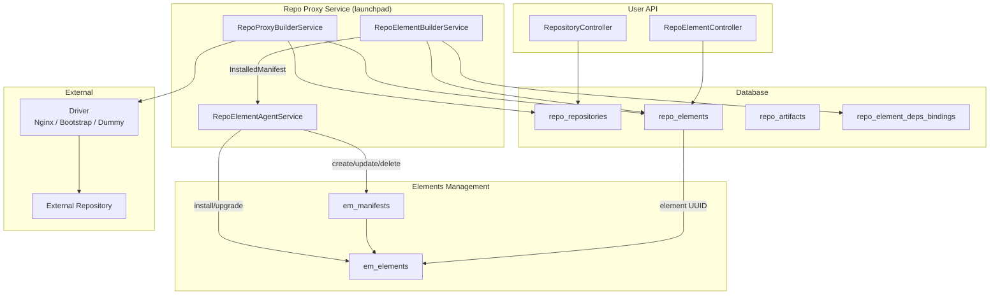

Repo Proxy is the subsystem that brings external element repositories into
Exordos Core. It discovers elements from remote sources, stores them locally,
resolves dependencies between elements, and bridges installed repo elements to
the Elements Management (EM) layer so they can be deployed on compute nodes.

## Overview

A **Repository** represents an external source of elements. Each repository is
backed by a **driver** that knows how to fetch the inventory and download
individual elements. Elements are stored as **RepoElements** with their
manifests, specifications, and artifacts. Users can install, upgrade, and
uninstall repo elements through the User API. Installation triggers the
universal-agent builder pipeline, which creates an EM Manifest and links it to
an EM Element.

The subsystem runs as part of the `exordos-repo-proxy-gservice` launchpad
process, which hosts three services:

1. **RepoProxyBuilderService** — manages repository lifecycle (creation,
   refresh, inventory sync).
2. **RepoElementBuilderService** — manages repo element lifecycle (install,
   upgrade, uninstall, dependency resolution).
3. **RepoElementAgentService** — universal agent that translates
   `repo_proxy_installed_element` resources into EM manifests and elements.

## Data Models

All models are defined in `exordos_core/repo/dm/models.py` and persisted in
PostgreSQL via restalchemy ORM.

### Repository

Table: `repo_repositories`

| Field | Type | Description |
|---|---|---|
| `uuid` | UUID PK | Unique identifier |
| `name` | String(255) | Repository name (unique per project) |
| `description` | Text | Free-form description |
| `project_id` | UUID | Owning project |
| `status` | Enum | `NEW`, `ACTIVE`, `IN_PROGRESS`, `DISABLED`, `ERROR` |
| `priority` | Integer (0–16384) | Higher = preferred for dependency resolution. Default: 8192 |
| `refresh_rate` | Integer (seconds) | How often to re-fetch inventory. 0 = disabled. Default: 3600 |
| `sync_mode` | Enum | `copy` — download full element data immediately; `lazy` — download only name/version, fetch manifest on demand |
| `driver_spec` | KindModel (JSONB) | Driver configuration. One of `NginxDriverSpec`, `BootstrapDriverSpec`, `DummyMigrationDriverSpec` |
| `next_refresh` | DateTime | When the next periodic refresh should occur |

Key methods:

- **`load_driver()`** — discovers and instantiates the correct driver by
  iterating entry points in the `exordos.repo_proxy.drivers` group. Each driver
  checks `driver_spec.KIND` and raises `ValueError` if it does not match. The
  first successful driver is cached in `__driver_map__`.
- **`iter_elements_in_inventory()`** — fetches the inventory via the driver and
  yields `RepoElement` instances one by one (generator).
- **`actualize_element(element)`** — downloads the full element data (manifest,
  specification, inventory) and replaces artifacts in the database.
- **`refresh()`** — sets `next_refresh` to now, triggering an early refresh.
- **`upload(name, version, manifest)`** — uploads an element to the repository
  if the driver supports it.

### RepoElement

Table: `repo_elements`

| Field | Type | Description |
|---|---|---|
| `uuid` | UUID PK | Unique identifier |
| `name` | String(255) | Element name |
| `version` | String(255) | Semantic version string |
| `description` | Text | Free-form description |
| `project_id` | UUID | Owning project |
| `repository` | FK → Repository | Parent repository |
| `status` | Enum | `NEW`, `AVAILABLE`, `ACTIVE`, `IN_PROGRESS`, `ERROR` |
| `installation_state` | Enum | `INSTALLED` or `UNINSTALLED` |
| `manifest` | JSONB | Full manifest dict (resources, requirements, exports, imports, etc.) |
| `specification` | JSONB | Specification dict |
| `inventory` | JSONB | Inventory dict (artifact index, configs, images, manifests) |
| `element` | UUID → `em_elements` | Linked EM Element UUID (set after installation) |

Unique constraint: `(repository, name, version)`.

Key methods:

- **`dependencies`** (property) — reads `manifest["requirements"]` and converts
  constraint keys: `from_version` → `>=`, `to_version` → `<`, `version` → `==`.
- **`install()`** — marks the element as `INSTALLED`. Rejects if another element
  with the same name is already installed.
- **`uninstall()`** — marks the element as `UNINSTALLED`. Rejects if other
  installed elements depend on it (checked via `RepoElementDepsBinding`).
- **`upgrade(target)`** — swaps installation state from the current element to a
  target element (same name, different version). The runtime EM Element UUID is
  transferred.
- **`edit(manifest)`** — replaces the manifest dict. Validates that `name` and
  `version` in the new manifest match the element's fields.
- **`from_inventory(repository, inventory)`** (classmethod) — creates a
  `RepoElement` and associated `RepoArtifact` instances from an inventory dict.

### RepoArtifact

Table: `repo_artifacts`

| Field | Type | Description |
|---|---|---|
| `uuid` | UUID PK | Unique identifier |
| `project_id` | UUID | Owning project |
| `element` | FK → RepoElement | Parent element |
| `urn` | String(2048) | Uniform Resource Name (category + key) |
| `uri` | String(2048) | Full URL for artifact access |

Unique constraint: `(element, urn)`.

### RepoElementDepsBinding

Table: `repo_element_deps_bindings`

| Field | Type | Description |
|---|---|---|
| `uuid` | UUID PK | Unique identifier |
| `element` | FK → RepoElement | The element that has dependencies |
| `depends_on` | FK → RepoElement | The element that is depended upon |

Unique constraint: `(element, depends_on)`.

This table records **transitive** dependency relationships. When element C
depends on B and B depends on A, two records are created for C: `(C, B)` and
`(C, A)`. The sole purpose is to prevent uninstallation of an element that sits
in the middle of a dependency chain — at uninstall time, the system checks
whether any `depends_on` record references the element being removed.

## Driver Specs

Driver specs are discriminated unions (kind models) stored in the
`driver_spec` JSONB column. Each spec has a `KIND` string that determines which
driver class handles it.

### NginxDriverSpec (`kind: "nginx"`)

For remote HTTP repositories served by Nginx (or any static file server).

| Field | Type | Description |
|---|---|---|
| `url` | String(2048) | Base URL of the repository |
| `username` | String(255) | Optional basic-auth username |
| `password` | String(255) | Optional basic-auth password |

The inventory file is fetched from `{url}/inventory.json`. Individual elements
are fetched from `{url}/{name}/{version}/manifests/{name}.yaml` and
`{url}/{name}/{version}/inventory.json`.

### BootstrapDriverSpec (`kind: "bootstrap"`)

For local filesystem repositories used during bootstrap. Reads YAML manifests
from a local directory.

| Field | Type | Description |
|---|---|---|
| `manifests_dir` | String(2048) | Path to directory containing manifest YAML files |

A file is considered a valid manifest if it has a `.yaml`/`.yml` extension, can
be loaded as YAML, is a dict, and contains `name`, `version`, and `resources`
keys.

### DummyMigrationDriverSpec (`kind: "dummy_migration"`)

A stub driver that exists solely so that `RepoElement` records can be attached
to a `Repository` during data migration from older installations that did not
have the repo proxy subsystem. It does not provide any real repository
functionality — `get_inventory()` returns an empty elements dict, and
`get_element()` reads from the database directly.

## Drivers

All drivers extend `AbstractProxyRepoDriver`
(`exordos_core/repo/drivers/base.py`) and are registered via the
`exordos.repo_proxy.drivers` entry point group in `pyproject.toml`:

```toml
[project.entry-points."exordos.repo_proxy.drivers"]
NginxProxyRepoDriver = "exordos_core.repo.drivers.nginx:NginxProxyRepoDriver"
BootstrapProxyRepoDriver = "exordos_core.repo.drivers.bootstrap:BootstrapProxyRepoDriver"
DummyMigrationRepoDriver = "exordos_core.repo.drivers.dummy_migration:DummyMigrationRepoDriver"
```

### Abstract interface

```python
class AbstractProxyRepoDriver(abc.ABC):
    def __init__(self, repository: Repository) -> None: ...

    @property
    @abc.abstractmethod
    def repo_uri(self) -> str: ...

    @abc.abstractmethod
    def artifact_uri(self, element_name, element_version, category, artifact_name) -> str: ...

    @abc.abstractmethod
    def get_inventory(self) -> dict: ...

    @abc.abstractmethod
    def get_element(self, name, version="latest") -> tuple[RepoElement, Collection[RepoArtifact]]: ...

    def can_upload_element(self, name, version) -> bool: ...
    def upload_element(self, element: RepoElement) -> None: ...
```

### Adding a new driver

1. Create a new driver spec model in `exordos_core/repo/dm/models.py` that
   extends `types_dynamic.AbstractKindModel` with a unique `KIND` string.
2. Add the spec to the `KindModelSelectorType` in `Repository.driver_spec`.
3. Implement the driver class in `exordos_core/repo/drivers/`, extending
   `AbstractProxyRepoDriver`. The constructor must raise `ValueError` if
   `repository.driver_spec.KIND` does not match.
4. Register the driver in `pyproject.toml` under
   `[project.entry-points."exordos.repo_proxy.drivers"]`.
5. Create a database migration if the spec introduces new fields that need
   schema changes (the `driver_spec` column is JSONB, so no migration is needed
   for new spec kinds).

## Services

### RepoProxyBuilderService

File: `exordos_core/repo/builders/repository.py`

Manages the repository lifecycle as a universal-agent builder service. The
model class `Repository` (in the builders module) extends `models.Repository`
with `InstanceMixin`, registering the resource kind
`repo_proxy_repository`.

Key behaviours:

- **`post_create_instance_resource`** — after a new repository is created,
  iterates the inventory and saves elements. In `copy` mode, each element is
  actualized (full data downloaded). In `lazy` mode, only name/version are
  saved. Sets status to `ACTIVE` and schedules `next_refresh`.
- **`_check_refresh`** — runs every 10 iterations
  (`REFRESH_CHECK_ITERATION_INTERVAL`). For each repository where
  `next_refresh` has passed, calls `repo.update(force=True)` to trigger the
  update hook.
- **`_refresh_repository`** — compares existing elements against the current
  inventory. Adds new elements, removes stale ones (but preserves installed
  elements). Updates `next_refresh`.
- **`post_update_instance_resource`** — if `next_refresh` has passed, calls
  `_refresh_repository`.

### RepoElementBuilderService

File: `exordos_core/repo/builders/element.py`

Manages the repo element lifecycle. The model class `RepoElement` (in the
builders module) extends `models.RepoElement` with
`InstanceWithDerivativesMixin`, registering the resource kind
`repo_proxy_element` and the derivative model `InstalledManifest` (kind
`repo_proxy_installed_element`).

#### InstalledManifest

A derivative model that represents an installed repo element in the universal
agent layer. It carries the manifest payload, version, status, and the UUID of
the runtime EM Element (`element` field). Created via
`InstalledManifest.from_repo_element(element)`.

#### Lifecycle detection

The service determines what action to take based on the combination of
`installation_state` and `element`:

| `installation_state` | `element` | Action |
|---|---|---|
| `INSTALLED` | `None` | **Install** — element needs to be installed |
| `INSTALLED` | set | **Upgrade** — element is installed and linked, may need update |
| `UNINSTALLED` | set | **Release** — element was installed, now being uninstalled |
| `UNINSTALLED` | `None` | **Delete** — ordinary deletion |

#### Dependency resolution

`_collect_dependencies(instance)` performs a recursive depth-first traversal of
the element's dependency graph:

1. If the element's manifest is empty (lazy mode), actualizes it first.
2. For each dependency (from `manifest["requirements"]`), queries all
   `RepoElement` records matching the dependency name.
3. Checks if any installed element violates the version constraint
   (`DependencyConstraintError`).
4. Filters candidates that satisfy the constraint
   (`_matches_version_constraint`).
5. If no candidates match, raises `DependencyNotFoundError`.
6. Selects the best candidate using `_element_sort_key` — preferring installed
   elements, higher repository priority, release versions, and higher version
   numbers.
7. Recurses into the selected dependency.
8. Returns a flat list in install order (dependencies first, element last).

Version comparison supports `==`, `>`, `>=`, `<`, `<=` operators. Release
versions (no suffix) are considered greater than development versions with the
same `major.minor.patch` base.

#### Installation flow

`_install_manifest(instance)`:

1. Collects the full dependency closure.
2. Installs each dependency in order (skips already-installed ones).
3. Records `RepoElementDepsBinding` entries for all transitive dependencies.
4. Sets element status to `IN_PROGRESS`.
5. Returns an `InstalledManifest` derivative, which the builder pushes to the
   universal agent.

#### Upgrade flow

Upgrades are handled carefully to avoid gaps in EM:

- The old `InstalledManifest` is **not** deleted before the new one is created.
- `can_update_instance_resource` checks that the pending (new) element has an
  `InstalledManifest` record with a linked `element` UUID before allowing the
  old one to be released.
- `update_instance_derivatives` returns the new derivative for installation,
  then on the next iteration returns an empty collection for the old element,
  triggering its deletion.

### RepoElementAgentService

File: `exordos_core/repo/agents/universal/service.py`

A universal agent service that exposes the `repo_proxy_installed_element`
capability to the orchestrator. It uses `RepoElementCapabilityDriver` as its
capability driver.

### RepoElementCapabilityDriver and RepoEmBackendClient

File: `exordos_core/repo/agents/universal/drivers/repo_element.py`

The capability driver wires a `RepoEmBackendClient` that translates universal
agent resource operations into EM lifecycle calls:

- **`_create`** — converts the resource to an EM `Manifest`, saves it, and
  calls `manifest.install()`. If the element is already installed, calls
  `manifest.upgrade()` instead. Stores the resulting EM Element UUID.
- **`_update`** — updates the EM Manifest fields and triggers
  `manifest.upgrade()` if resource fields changed.
- **`_delete`** — calls `manifest.uninstall()` then `manifest.delete()`.
- **`_list`** — joins EM Manifests with EM Elements by `(name, version)` and
  returns `InstalledManifest` instances.

Target fields are stored locally in a JSON file
(`repo_elements_target_fields.json`) inside the agent work directory.

## API

The User API is served under `/v1/repo/` and defined in
`exordos_core/user_api/repo/api/`.

### Endpoints

| Method | Path | Description |
|---|---|---|
| GET/FILTER | `/v1/repo/repositories` | List/filter repositories |
| POST | `/v1/repo/repositories` | Create a repository |
| GET | `/v1/repo/repositories/{uuid}` | Get a repository |
| PUT | `/v1/repo/repositories/{uuid}` | Update a repository |
| DELETE | `/v1/repo/repositories/{uuid}` | Delete a repository |
| POST | `/v1/repo/repositories/{uuid}/actions/refresh/invoke` | Force refresh |
| POST | `/v1/repo/repositories/{uuid}/actions/upload/invoke` | Upload element |
| GET/FILTER | `/v1/repo/elements` | List/filter repo elements |
| GET | `/v1/repo/elements/{uuid}` | Get element (actualizes if lazy) |
| DELETE | `/v1/repo/elements/{uuid}` | Delete element |
| POST | `/v1/repo/elements/{uuid}/actions/install/invoke` | Install element |
| POST | `/v1/repo/elements/{uuid}/actions/uninstall/invoke` | Uninstall element |
| POST | `/v1/repo/elements/{uuid}/actions/upgrade/invoke` | Upgrade element |
| POST | `/v1/repo/elements/{uuid}/actions/edit/invoke` | Edit manifest |

### Field permissions

- **Repository**: `status`, `created_at`, `updated_at` are read-only.
  `next_refresh` is hidden from API responses.
- **RepoElement**: `status`, `created_at`, `updated_at` are read-only.
  `installation_state` is hidden from API responses.

### IAM

Both controllers use `PolicyBasedController` with policy service name `repo`.
Repository resources use policy name `repository`; element resources use
policy name `element`.

## Inventory Format

The inventory is a JSON document served by the repository driver. It lists all
available elements:

```json
{
    "elements": {
        "core": {
            "0.1.12-dev+abc123": {
                "name": "core",
                "version": "0.1.12-dev+abc123",
                "artifacts": ["openapi_user.yaml"],
                "configs": [],
                "images": ["exordos-core.qcow2"],
                "manifests": ["core.yaml"],
                "templates": [],
                "index": {
                    "artifacts": {"<uuid>": "openapi_user.yaml"},
                    "configs": {},
                    "images": {"<uuid>": "exordos-core.qcow2"},
                    "manifests": {"<uuid>": "core.yaml"},
                    "templates": {}
                }
            }
        }
    }
}
```

Each element version entry contains:

- **`artifacts`**, **`configs`**, **`images`**, **`manifests`**, **`templates`** —
  lists of file names by category.
- **`index`** — maps each category to a dict of `{uuid: filename}` entries. The
  uuid is used to construct the artifact URN as `{category}:{uuid}`.

## Exceptions

Defined in `exordos_core/repo/exceptions.py`:

- **`DependencyNotFoundError`** — no suitable dependency element found matching
  the name and version constraint.
- **`DependencyConstraintError`** — an installed dependency exists but its
  version does not satisfy the required constraint.
- **`DependencyConstraintFormatError`** — the constraint dict contains
  unsupported operators.

## Configuration

### Launchpad (`exordos_core.conf.j2`)

```ini
[launchpad]
common_registrator_opts = exordos_core.cmd.repo_proxy_gservice:register_common_opts
common_initializer = exordos_core.cmd.repo_proxy_gservice:init_common_conf
services =
    exordos_core.repo.builders.repository:RepoProxyBuilderService,
    exordos_core.repo.builders.element:RepoElementBuilderService,
    exordos_core.repo.agents.universal.service:RepoElementAgentService
```

### Universal Agent (`exordos_universal_agent.conf.j2`)

The `repo_proxy_installed_element` capability must be listed in the scheduler:

```ini
[universal_agent_scheduler]
capabilities =
    em_*,
    password,
    certificate,
    paas_lb_agent,
    repo_proxy_installed_element
```

## Architecture Diagram



## Key Design Decisions

- **Lazy vs Copy sync modes**: Lazy mode stores only element name/version at
  discovery time, deferring the full manifest download until the element is
  actually accessed (via API GET or during installation). This reduces initial
  load for large repositories. Copy mode downloads everything upfront.
- **Driver discovery via entry points**: Drivers are discovered at runtime via
  Python entry points, allowing third-party drivers to be registered without
  modifying core code. The `load_driver()` method tries each registered driver
  and uses the first one that accepts the `driver_spec` kind.
- **Dependency bindings for uninstall safety**: The `RepoElementDepsBinding`
  table exists solely to prevent uninstallation of elements that other installed
  elements depend on. It stores transitive dependencies, so even indirect
  dependents block uninstallation.
- **Upgrade ordering**: During upgrade, the old `InstalledManifest` is kept
  alive until the new one is confirmed installed with a linked EM Element. This
  prevents a gap where the element is temporarily absent from EM.
- **DummyMigrationRepoDriver**: Exists for backward compatibility — older
  installations that predate repo proxy need their existing elements attached to
  a repository. This stub driver allows that without requiring a real external
  repository.

## See also

- [Core Developer Guide](index.md) — architecture overview, element engine, reconciliation
- [Exports reference](exports.md) — how elements share resources
- [Manifest reference](../em/manifest.md) — manifest YAML specification
