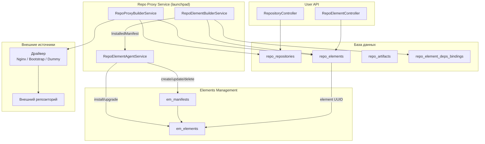

Repo Proxy — подсистема, которая интегрирует внешние репозитории элементов в
Exordos Core. Она обнаруживает элементы из внешних источников, сохраняет их
локально, разрешает зависимости между элементами и связывает установленные
элементы репозитория со слоем Elements Management (EM), чтобы их можно было
развёртывать на вычислительных нодах.

## Обзор

**Repository** (репозиторий) представляет внешний источник элементов. Каждый
репозиторий обслуживается **драйвером**, который умеет получать инвентарь и
загружать отдельные элементы. Элементы сохраняются как **RepoElement** вместе с
манифестами, спецификациями и артефактами. Пользователи могут устанавливать,
обновлять и удалять элементы через User API. Установка запускает конвейер
universal-agent builder, который создаёт EM-манифест и связывает его с
EM-элементом.

Подсистема работает в составе процесса launchpad `exordos-repo-proxy-gservice`,
в котором размещены три сервиса:

1. **RepoProxyBuilderService** — управляет жизненным циклом репозитория
   (создание, обновление, синхронизация инвентаря).
2. **RepoElementBuilderService** — управляет жизненным циклом элементов
   репозитория (установка, обновление, удаление, разрешение зависимостей).
3. **RepoElementAgentService** — universal agent, транслирующий ресурсы
   `repo_proxy_installed_element` в EM-манифесты и EM-элементы.

## Модели данных

Все модели определены в `exordos_core/repo/dm/models.py` и сохраняются в
PostgreSQL через ORM restalchemy.

### Repository

Таблица: `repo_repositories`

| Поле | Тип | Описание |
|---|---|---|
| `uuid` | UUID PK | Уникальный идентификатор |
| `name` | String(255) | Имя репозитория (уникально в рамках проекта) |
| `description` | Text | Произвольное описание |
| `project_id` | UUID | Проект-владелец |
| `status` | Enum | `NEW`, `ACTIVE`, `IN_PROGRESS`, `DISABLED`, `ERROR` |
| `priority` | Integer (0–16384) | Выше = предпочтительнее при разрешении зависимостей. По умолчанию: 8192 |
| `refresh_rate` | Integer (секунды) | Периодичность обновления инвентаря. 0 = отключено. По умолчанию: 3600 |
| `sync_mode` | Enum | `copy` — полная загрузка данных элемента сразу; `lazy` — сохраняется только имя/версия, манифест загружается по запросу |
| `driver_spec` | KindModel (JSONB) | Конфигурация драйвера: `NginxDriverSpec`, `BootstrapDriverSpec` или `DummyMigrationDriverSpec` |
| `next_refresh` | DateTime | Время следующего планового обновления |

Ключевые методы:

- **`load_driver()`** — обнаруживает и создаёт экземпляр нужного драйвера,
  перебирая entry points из группы `exordos.repo_proxy.drivers`. Каждый драйвер
  проверяет `driver_spec.KIND` и выбрасывает `ValueError` при несовпадении.
  Первый успешный драйвер кэшируется в `__driver_map__`.
- **`iter_elements_in_inventory()`** — получает инвентарь через драйвер и
  по одному возвращает экземпляры `RepoElement` (генератор).
- **`actualize_element(element)`** — загружает полные данные элемента
  (манифест, спецификацию, инвентарь) и заменяет артефакты в базе данных.
- **`refresh()`** — устанавливает `next_refresh` в текущее время, принудительно
  запуская обновление.
- **`upload(name, version, manifest)`** — загружает элемент в репозиторий,
  если драйвер поддерживает эту операцию.

### RepoElement

Таблица: `repo_elements`

| Поле | Тип | Описание |
|---|---|---|
| `uuid` | UUID PK | Уникальный идентификатор |
| `name` | String(255) | Имя элемента |
| `version` | String(255) | Семантическая версия |
| `description` | Text | Произвольное описание |
| `project_id` | UUID | Проект-владелец |
| `repository` | FK → Repository | Родительский репозиторий |
| `status` | Enum | `NEW`, `AVAILABLE`, `ACTIVE`, `IN_PROGRESS`, `ERROR` |
| `installation_state` | Enum | `INSTALLED` или `UNINSTALLED` |
| `manifest` | JSONB | Полный манифест (resources, requirements, exports, imports и т.д.) |
| `specification` | JSONB | Спецификация |
| `inventory` | JSONB | Инвентарь (индекс артефактов, configs, images, manifests) |
| `element` | UUID → `em_elements` | UUID связанного EM-элемента (устанавливается после установки) |

Уникальное ограничение: `(repository, name, version)`.

Ключевые методы:

- **`dependencies`** (property) — читает `manifest["requirements"]` и
  преобразует ключи ограничений: `from_version` → `>=`, `to_version` → `<`,
  `version` → `==`.
- **`install()`** — помечает элемент как `INSTALLED`. Отклоняет операцию, если
  другой элемент с тем же именем уже установлен.
- **`uninstall()`** — помечает элемент как `UNINSTALLED`. Отклоняет операцию,
  если от элемента зависят другие установленные элементы (проверка через
  `RepoElementDepsBinding`).
- **`upgrade(target)`** — переносит состояние установки с текущего элемента на
  целевой (то же имя, другая версия). UUID runtime EM-элемента переносится.
- **`edit(manifest)`** — заменяет манифест. Проверяет, что `name` и `version` в
  новом манифесте совпадают с полями элемента.
- **`from_inventory(repository, inventory)`** (classmethod) — создаёт
  `RepoElement` и связанные `RepoArtifact` из словаря инвентаря.

### RepoArtifact

Таблица: `repo_artifacts`

| Поле | Тип | Описание |
|---|---|---|
| `uuid` | UUID PK | Уникальный идентификатор |
| `project_id` | UUID | Проект-владелец |
| `element` | FK → RepoElement | Родительский элемент |
| `urn` | String(2048) | Uniform Resource Name (категория + ключ) |
| `uri` | String(2048) | Полный URL для доступа к артефакту |

Уникальное ограничение: `(element, urn)`.

### RepoElementDepsBinding

Таблица: `repo_element_deps_bindings`

| Поле | Тип | Описание |
|---|---|---|
| `uuid` | UUID PK | Уникальный идентификатор |
| `element` | FK → RepoElement | Элемент, имеющий зависимости |
| `depends_on` | FK → RepoElement | Элемент, от которого зависит |

Уникальное ограничение: `(element, depends_on)`.

Эта таблица хранит **транзитивные** зависимости. Если элемент C зависит от B, а
B зависит от A, для C создаются две записи: `(C, B)` и `(C, A)`. Единственная
цель таблицы — предотвратить удаление элемента, от которого зависят другие
установленные элементы: при удалении система проверяет, есть ли записи
`depends_on`, ссылающиеся на удаляемый элемент.

## Спецификации драйверов

Спецификации драйверов — это discriminated unions (kind models), хранящиеся в
JSONB-колонке `driver_spec`. Каждая спецификация имеет строку `KIND`, которая
определяет, какой класс драйвера её обрабатывает.

### NginxDriverSpec (`kind: "nginx"`)

Для удалённых HTTP-репозиториев, обслуживаемых Nginx (или любым статическим
файловым сервером).

| Поле | Тип | Описание |
|---|---|---|
| `url` | String(2048) | Базовый URL репозитория |
| `username` | String(255) | Опциональное имя пользователя для basic-auth |
| `password` | String(255) | Опциональный пароль для basic-auth |

Файл инвентаря загружается с `{url}/inventory.json`. Отдельные элементы — с
`{url}/{name}/{version}/manifests/{name}.yaml` и
`{url}/{name}/{version}/inventory.json`.

### BootstrapDriverSpec (`kind: "bootstrap"`)

Для локальных файловых репозиториев, используемых при начальной загрузке
(bootstrap). Читает YAML-манифесты из локальной директории.

| Поле | Тип | Описание |
|---|---|---|
| `manifests_dir` | String(2048) | Путь к директории с YAML-файлами манифестов |

Файл считается валидным манифестом, если он имеет расширение `.yaml`/`.yml`,
может быть загружен как YAML, является словарем и содержит ключи `name`,
`version` и `resources`.

### DummyMigrationDriverSpec (`kind: "dummy_migration"`)

Заглушка-драйвер, существующая исключительно для того, чтобы записи
`RepoElement` могли быть привязаны к `Repository` при миграции данных со старых
инсталляций, где подсистема repo proxy отсутствовала. Не предоставляет реальной
функциональности репозитория — `get_inventory()` возвращает пустой словарь
элементов, а `get_element()` читает данные напрямую из базы.

## Драйверы

Все драйверы наследуются от `AbstractProxyRepoDriver`
(`exordos_core/repo/drivers/base.py`) и регистрируются через группу entry
points `exordos.repo_proxy.drivers` в `pyproject.toml`:

```toml
[project.entry-points."exordos.repo_proxy.drivers"]
NginxProxyRepoDriver = "exordos_core.repo.drivers.nginx:NginxProxyRepoDriver"
BootstrapProxyRepoDriver = "exordos_core.repo.drivers.bootstrap:BootstrapProxyRepoDriver"
DummyMigrationRepoDriver = "exordos_core.repo.drivers.dummy_migration:DummyMigrationRepoDriver"
```

### Абстрактный интерфейс

```python
class AbstractProxyRepoDriver(abc.ABC):
    def __init__(self, repository: Repository) -> None: ...

    @property
    @abc.abstractmethod
    def repo_uri(self) -> str: ...

    @abc.abstractmethod
    def artifact_uri(self, element_name, element_version, category, artifact_name) -> str: ...

    @abc.abstractmethod
    def get_inventory(self) -> dict: ...

    @abc.abstractmethod
    def get_element(self, name, version="latest") -> tuple[RepoElement, Collection[RepoArtifact]]: ...

    def can_upload_element(self, name, version) -> bool: ...
    def upload_element(self, element: RepoElement) -> None: ...
```

### Добавление нового драйвера

1. Создайте новую модель спецификации в `exordos_core/repo/dm/models.py`,
   наследующую `types_dynamic.AbstractKindModel` с уникальной строкой `KIND`.
2. Добавьте спецификацию в `KindModelSelectorType` в `Repository.driver_spec`.
3. Реализуйте класс драйвера в `exordos_core/repo/drivers/`, унаследовав его от
   `AbstractProxyRepoDriver`. Конструктор должен выбрасывать `ValueError`, если
   `repository.driver_spec.KIND` не совпадает.
4. Зарегистрируйте драйвер в `pyproject.toml` в секции
   `[project.entry-points."exordos.repo_proxy.drivers"]`.
5. Создайте миграцию базы данных, если спецификация вводит новые поля,
   требующие изменения схемы (колонка `driver_spec` имеет тип JSONB, поэтому
   для новых видов спецификаций миграция не нужна).

## Сервисы

### RepoProxyBuilderService

Файл: `exordos_core/repo/builders/repository.py`

Управляет жизненным циклом репозитория как universal-agent builder service.
Класс модели `Repository` (в модуле builders) расширяет `models.Repository`
через `InstanceMixin`, регистрируя resource kind `repo_proxy_repository`.

Ключевое поведение:

- **`post_create_instance_resource`** — после создания нового репозитория
  перебирает инвентарь и сохраняет элементы. В режиме `copy` каждый элемент
  актуализируется (полная загрузка данных). В режиме `lazy` сохраняется только
  имя/версия. Устанавливает статус `ACTIVE` и планирует `next_refresh`.
- **`refresh`** — запускается каждые 10 итераций
  (`REFRESH_CHECK_ITERATION_INTERVAL`). Для каждого репозитория, у которого
  `next_refresh` прошёл, вызывает `repo.update(force=True)` для запуска хука
  обновления.
- **`_refresh_repository`** — сравнивает существующие элементы с текущим
  инвентарём. Добавляет новые элементы, удаляет устаревшие (но сохраняет
  установленные). Обновляет `next_refresh`.
- **`post_update_instance_resource`** — если `next_refresh` прошёл, вызывает
  `_refresh_repository`.

### RepoElementBuilderService

Файл: `exordos_core/repo/builders/element.py`

Управляет жизненным циклом элементов репозитория. Класс модели `RepoElement`
(в модуле builders) расширяет `models.RepoElement` через
`InstanceWithDerivativesMixin`, регистрируя resource kind `repo_proxy_element`
и производную модель `InstalledManifest` (kind
`repo_proxy_installed_element`).

#### InstalledManifest

Производная модель, представляющая установленный элемент репозитория на уровне
universal agent. Содержит манифест, версию, статус и UUID runtime EM-элемента
(поле `element`). Создаётся через `InstalledManifest.from_repo_element(element)`.

#### Определение действия

Сервис определяет действие по комбинации `installation_state` и `element`:

| `installation_state` | `element` | Действие |
|---|---|---|
| `INSTALLED` | `None` | **Установка** — элемент нужно установить |
| `INSTALLED` | задан | **Обновление** — элемент установлен и связан, возможно обновление |
| `UNINSTALLED` | задан | **Освобождение** — элемент был установлен, теперь удаляется |
| `UNINSTALLED` | `None` | **Удаление** — обычное удаление |

#### Разрешение зависимостей

`_collect_dependencies(instance)` выполняет рекурсивный обход графа
зависимостей в глубину:

1. Если манифест элемента пуст (режим lazy), сначала актуализирует его.
2. Для каждой зависимости (из `manifest["requirements"]`) запрашивает все
   записи `RepoElement` с совпадающим именем.
3. Проверяет, не нарушает ли уже установленный элемент ограничение версии
   (`DependencyConstraintError`).
4. Фильтрует кандидатов, удовлетворяющих ограничению
   (`_matches_version_constraint`).
5. Если подходящих кандидатов нет, выбрасывает `DependencyNotFoundError`.
6. Выбирает лучшего кандидата через `_element_sort_key` — предпочтение отдаётся
   установленным элементам, более высокому приоритету репозитория, release-версиям
   и более высоким номерам версий.
7. Рекурсивно обходит выбранную зависимость.
8. Возвращает плоский список в порядке установки (сначала зависимости, элемент
   последним).

Сравнение версий поддерживает операторы `==`, `>`, `>=`, `<`, `<=`. Release-версии
(без суффикса) считаются больше development-версий с тем же
`major.minor.patch`.

#### Процесс установки

`_install_manifest(instance)`:

1. Собирает полное транзитивное замыкание зависимостей.
2. Устанавливает каждую зависимость по порядку (пропускает уже установленные).
3. Записывает `RepoElementDepsBinding` для всех транзитивных зависимостей.
4. Устанавливает статус элемента в `IN_PROGRESS`.
5. Возвращает производную `InstalledManifest`, которую builder передаёт
   universal agent.

#### Процесс обновления

Обновление выполняется аккуратно, чтобы избежать провалов в EM:

- Старый `InstalledManifest` **не удаляется** до создания нового.
- `can_update_instance_resource` проверяет, что для нового (pending) элемента
  существует запись `InstalledManifest` со связанным UUID `element`, прежде чем
  разрешить освобождение старого.
- `update_instance_derivatives` возвращает новую производную для установки, а
  на следующей итерации возвращает пустую коллекцию для старого элемента,
  запуская его удаление.

### RepoElementAgentService

Файл: `exordos_core/repo/agents/universal/service.py`

Universal agent service, предоставляющий capability
`repo_proxy_installed_element` оркестратору. Использует
`RepoElementCapabilityDriver` в качестве драйвера возможностей.

### RepoElementCapabilityDriver и RepoEmBackendClient

Файл: `exordos_core/repo/agents/universal/drivers/repo_element.py`

Драйвер возможностей связывает `RepoEmBackendClient`, который транслирует
операции universal agent с ресурсами в вызовы жизненного цикла EM:

- **`_create`** — конвертирует ресурс в EM `Manifest`, сохраняет его и вызывает
  `manifest.install()`. Если элемент уже установлен, вызывает
  `manifest.upgrade()`. Сохраняет UUID полученного EM-элемента.
- **`_update`** — обновляет поля EM-манифеста и запускает
  `manifest.upgrade()`, если ресурсные поля изменились.
- **`_delete`** — вызывает `manifest.uninstall()`, затем `manifest.delete()`.
- **`_list`** — объединяет EM-манифесты с EM-элементами по `(name, version)` и
  возвращает экземпляры `InstalledManifest`.

Target fields хранятся локально в JSON-файле
(`repo_elements_target_fields.json`) в рабочей директории агента.

## API

User API обслуживается по пути `/v1/repo/` и определён в
`exordos_core/user_api/repo/api/`.

### Endpoints

| Метод | Путь | Описание |
|---|---|---|
| GET/FILTER | `/v1/repo/repositories` | Список/фильтрация репозиториев |
| POST | `/v1/repo/repositories` | Создать репозиторий |
| GET | `/v1/repo/repositories/{uuid}` | Получить репозиторий |
| PUT | `/v1/repo/repositories/{uuid}` | Обновить репозиторий |
| DELETE | `/v1/repo/repositories/{uuid}` | Удалить репозиторий |
| POST | `/v1/repo/repositories/{uuid}/actions/refresh/invoke` | Принудительное обновление |
| POST | `/v1/repo/repositories/{uuid}/actions/upload/invoke` | Загрузить элемент |
| GET/FILTER | `/v1/repo/elements` | Список/фильтрация элементов |
| GET | `/v1/repo/elements/{uuid}` | Получить элемент (актуализирует в lazy-режиме) |
| DELETE | `/v1/repo/elements/{uuid}` | Удалить элемент |
| POST | `/v1/repo/elements/{uuid}/actions/install/invoke` | Установить элемент |
| POST | `/v1/repo/elements/{uuid}/actions/uninstall/invoke` | Удалить установку элемента |
| POST | `/v1/repo/elements/{uuid}/actions/upgrade/invoke` | Обновить элемент |
| POST | `/v1/repo/elements/{uuid}/actions/edit/invoke` | Редактировать манифест |

### Права доступа к полям

- **Repository**: `status`, `created_at`, `updated_at` — только для чтения.
  `next_refresh` скрыт в ответах API.
- **RepoElement**: `status`, `created_at`, `updated_at` — только для чтения.
  `installation_state` скрыт в ответах API.

### IAM

Оба контроллера используют `PolicyBasedController` с именем политики `repo`.
Ресурсы репозитория используют имя политики `repository`; ресурсы элементов —
`element`.

## Формат инвентаря

Инвентарь — JSON-документ, возвращаемый драйвером репозитория. Содержит список
всех доступных элементов:

```json
{
    "elements": {
        "core": {
            "0.1.12-dev+abc123": {
                "name": "core",
                "version": "0.1.12-dev+abc123",
                "artifacts": ["openapi_user.yaml"],
                "configs": [],
                "images": ["exordos-core.qcow2"],
                "manifests": ["core.yaml"],
                "templates": [],
                "index": {
                    "artifacts": {"<uuid>": "openapi_user.yaml"},
                    "configs": {},
                    "images": {"<uuid>": "exordos-core.qcow2"},
                    "manifests": {"<uuid>": "core.yaml"},
                    "templates": {}
                }
            }
        }
    }
}
```

Каждая запись версии элемента содержит:

- **`artifacts`**, **`configs`**, **`images`**, **`manifests`**, **`templates`** —
  списки имён файлов по категориям.
- **`index`** — отображает каждую категорию на словарь `{uuid: filename}`. UUID
  используется для построения URN артефакта в формате `{category}:{uuid}`.

## Исключения

Определены в `exordos_core/repo/exceptions.py`:

- **`DependencyNotFoundError`** — не найден подходящий элемент-зависимость,
  удовлетворяющий имени и ограничению версии.
- **`DependencyConstraintError`** — установленная зависимость существует, но её
  версия не удовлетворяет требуемому ограничению.
- **`DependencyConstraintFormatError`** — словарь ограничений содержит
  неподдерживаемые операторы.

## Конфигурация

### Launchpad (`exordos_core.conf.j2`)

```ini
[launchpad]
common_registrator_opts = exordos_core.cmd.repo_proxy_gservice:register_common_opts
common_initializer = exordos_core.cmd.repo_proxy_gservice:init_common_conf
services =
    exordos_core.repo.builders.repository:RepoProxyBuilderService,
    exordos_core.repo.builders.element:RepoElementBuilderService,
    exordos_core.repo.agents.universal.service:RepoElementAgentService
```

### Universal Agent (`exordos_universal_agent.conf.j2`)

Capability `repo_proxy_installed_element` должна быть указана в планировщике:

```ini
[universal_agent_scheduler]
capabilities =
    em_*,
    password,
    certificate,
    paas_lb_agent,
    repo_proxy_installed_element
```

## Архитектурная диаграмма



## Ключевые архитектурные решения

- **Режимы синхронизации lazy и copy**: В режиме lazy при обнаружении элемента
  сохраняется только имя и версия, полная загрузка манифеста откладывается до
  момента обращения к элементу (через API GET или при установке). Это снижает
  начальную нагрузку для больших репозиториев. В режиме copy всё загружается
  сразу.
- **Обнаружение драйверов через entry points**: Драйверы обнаруживаются во время
  выполнения через Python entry points, что позволяет регистрировать сторонние
  драйверы без изменения основного кода. Метод `load_driver()` перебирает
  зарегистрированные драйверы и использует первый, принимающий `driver_spec`
  kind.
- **Привязки зависимостей для безопасного удаления**: Таблица
  `RepoElementDepsBinding` существует исключительно для предотвращения удаления
  элементов, от которых зависят другие установленные элементы. Она хранит
  транзитивные зависимости, поэтому даже косвенные зависимые блокируют удаление.
- **Порядок обновления**: При обновлении старый `InstalledManifest` сохраняется
  до подтверждения установки нового со связанным EM-элементом. Это предотвращает
  ситуацию, когда элемент временно отсутствует в EM.
- **DummyMigrationRepoDriver**: Существует для обратной совместимости — старые
  инсталляции, предшествующие repo proxy, требуют привязки существующих
  элементов к репозиторию. Эта заглушка позволяет это без необходимости в
  реальном внешнем репозитории.

## См. также

- [Руководство для разработчиков ядра](core-guide.md) — обзор архитектуры, element engine, reconciliation
- [Справочник по манифесту](../em/manifest.md) — спецификация YAML-манифеста
